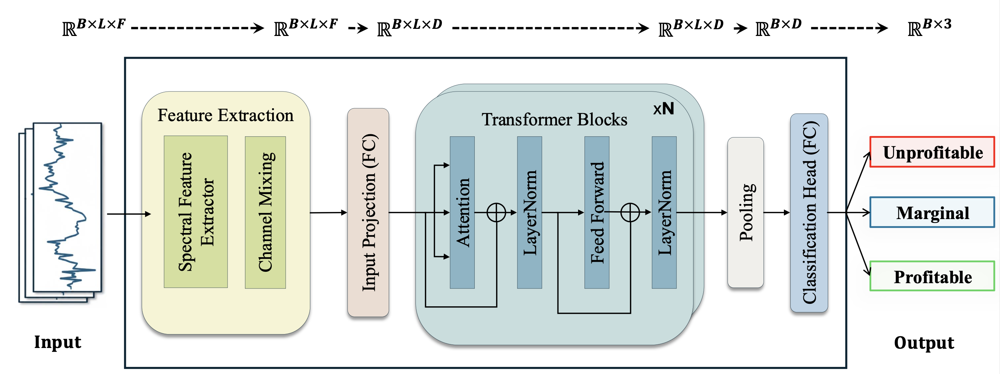

# Smart Timing for Mining: A Deep Learning Framework for Bitcoin Hardware ROI prediction

This repository contains the code and dataset accompanying the paper "Smart Timing for Mining: A Deep Learning
Framework for Bitcoin Hardware ROI prediction" by Sithumi Wickramasinghe (PhD candidate), Prof. Bikramjith Das, and Prof. Dorien Herremans.

<div align="center">
  
</div>

We propose MineROI-Net a Transformer-based architecture for **timing Bitcoin mining hardware purchases**.  
Given a 30- or 60-day window of machine, market, and network features, the model predicts whether
buying a specific ASIC miner on a given day will be:

- **Unprofitable** (ROI ≤ 0)  
- **Marginal** (0 < ROI < 1)  
- **Profitable** (ROI ≥ 1 within 365 days)

This repository contains the PyTorch implementation, data preprocessing pipeline, and experiments
used in our paper.

---

# Overview

Bitcoin mining is capital-intensive and highly sensitive to market cycles, halving events, hardware
efficiency, and electricity prices. MineROI-Net formulates the **hardware acquisition timing**
problem as a **multi-class time series classification task**.

The model combines:

1. **Spectral Feature Extractor**  
   - FFT-based layer with learnable complex weights to highlight important frequency components
     (halving cycles, difficulty adjustment cycles, etc.).

2. **Channel Mixing Module**  
   - Squeeze-and-Excitation style feature re-weighting that captures cross-feature interactions
     (e.g., price vs. electricity cost dominance) in a lightweight way.

3. **Transformer Encoder**  
   - Standard multi-head self-attention over the processed sequence, followed by global pooling and
     a classification head.

MineROI-Net outperforms LSTM-based and TSLANet baselines on data from **20 ASIC miners (2015–2024)**,
achieving strong accuracy and macro-F1 while being economically well-behaved (very high precision
for profitable and unprofitable periods).

---


# Repository structure

A minimal structure (yours may contain more folders):

```text
MineROI-Net/
│
├── country_wise_data/
│   ├── final_china.csv
│   ├── final_ethiopia.csv
│   ├── final_texas.csv
│   ├── china_seq/           # (generated sequences for china)
│   ├── ethiopia_seq/        # (generated sequences for ethiopia)
│   ├── texas_seq/           # (generated sequences for texas)
│   └── seq_30/              # (final data for model when loock back window = 30)
│   └── seq_60/              # (final data for model when loock back window = 60)
│   └── ...
│
├── final_split/
│   ├── dataloader.py                # preprocessing + CV pipeline
│   └── transformer_final_split.py   # MineROI-Net model + training loop
│   └── ...
│
├── results_seq_30/      # final results when loock back window = 30 
├── results_seq_60/      # final results when loock back window = 60 
└── README.md
```

# Dataset

The dataset integrates three main sources, **(i) ASIC machine data (ii) Blockchain data (iii) Energy prices** (see Section 4.1 of the paper):


<!-- Each day is labelled with a **1-year ROI** for a given machine using:

$$
\text{ROI} = \frac{R(M, d_i, 365) - C_O(M, d_i, 365)}{C_M(M, d_i)}
$$

and then discretized into **{unprofitable, marginal, profitable}** based on economically meaningful thresholds. -->

> **Note**  
> Due to data-source restrictions, we do not redistribute raw ASIC pricing data.  
> Follow the data sources listed in the paper to reconstruct the dataset, or plug in your own mining data.

Place your processed CSV files in:

```text
MineROI-Net/country_wise_data/
    final_china.csv
    final_ethiopia.csv
    final_texas.csv
```

# Preprocessing

All preprocessing for cross-validation and final splits is handled by dataloader.py.

```text
From the final_split/ directory:
cd final_split

# For SEQ_LEN = 30 (default in the script)
python dataloader.py

# Or edit the SEQ_LEN argument in the main:
# if __name__ == "__main__":
#     run_all_cv_preprocessing(SEQ_LEN=30)
```

This script:
1. Loads each country’s CSV.
2. Builds time-series windows with look-back SEQ_LEN (30 or 60 days).
3. Applies train/val/test splitting using the expanding-window strategy.
4. Scales features using MinMaxScaler fitted on the training split.
5. Saves processed tensors (.pt files) for each split and country.
6. Combines countries and converts to the final LSTM/Transformer-ready format.


# Model: MineROI-Net and Training

The main model implementation and training script live in transformer_final_split.py.
Key components:
* SpectralFeatureExtractor
* ChannelMixing
* Transformer encoder
* Training loop with weighted cross-entropy + label smoothing
* Evaluation utilities: accuracy, macro-F1, ROC/AUC, confusion matrices


From the final_split/ directory:
```text
cd final_split

# Run the main experiment script
python transformer_final_split.py
```

The script:
* defines hyperparameter grids for SEQ_LEN=30 or 60
* runs experiments over all combinations (or a subset, depending on how you configure it)
* trains MineROI-Net, LSTM-baseline, and/or TSLANet
* tracks metrics with Weights & Biases (wandb)
* saves the best model weights and evaluation plots in results_seq_30/ or results_seq_60/.

If you want a lighter run for debugging, edit:
* the SEEDS list
* the hyperparameter grid in param_grids
* number of epochs 


